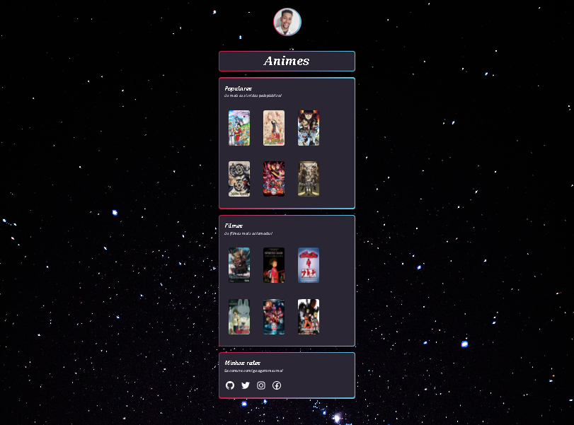

# NLW Projeto - Trilha Explorer

> Trilha Explorer

Meu primeiro projeto, desafio proposto pelo Next Level Week da Rocketseat.

[🔗 Clique aqui para acessar](https://luckhenry.github.io/eSports-myproject/)

## 🛠Tecnologias

-  HTML
- CSS
- Git e Github

## 📚 O que aprendi
Após o encerramento da Next Level Week, foi proposto esse último desafio, onde deveriamos criar um projeto que fosse a nossa cara. Com esse desafio consegui aprender um pouco mais de tags html, pude testar diferentes estilizações em CSS e aprendi um pouco mais a manipular o Github.

## 📧📞Contato
rochalucassilva0@gmail.com  
+55(11)963465369